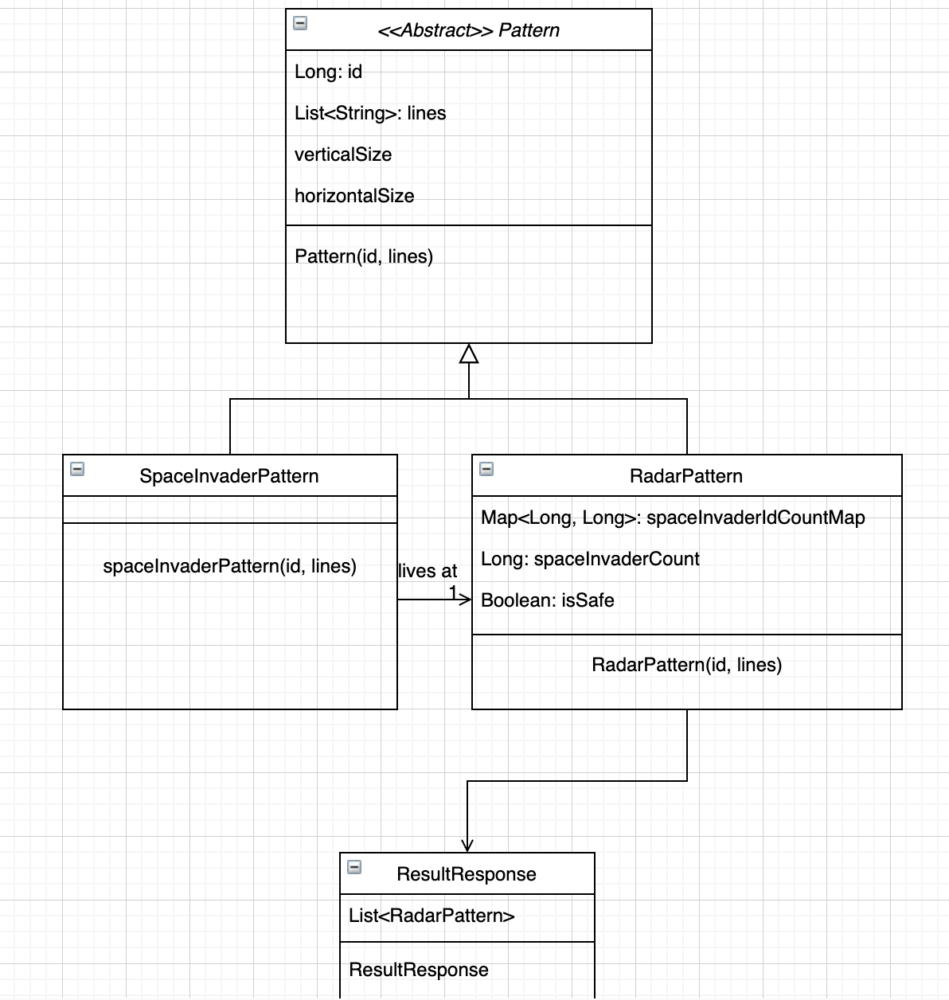

# Fuga dev assignment

Oh no, it's the SPACE INVADERS! But this time, you only see them on a very noisy radar image. Your mission is to write a
program that detects space invaders in this image.

The program must take a radar image as input, like the example below, and detect any of the known list of space
invaders.

### Requirements:

- Advance image detection techniques are not required, brute force match is fine
- Do not focus on algorithm design, but on code structure, proper design principles, tests, readability etc.
- Production-like code is expected

### Tips:

- The noise in the radar image can be either false positives or false negatives
- Think of edge cases ... pun intended ;)
- Feel free to use the language, frameworks and tools you feel comfortable with, but also keep in mind the position
  you're applying for and what languages and tools the team you'd be integrating at are using.

### Known space invaders:

~~~~
--o-----o--
---o---o---
--ooooooo--
-oo-ooo-oo-
ooooooooooo
o-ooooooo-o
o-o-----o-o
---oo-oo---
~~~~

~~~~
---oo---
--oooo--
-oooooo-
oo-oo-oo
oooooooo
--o--o--
-o-oo-o-
o-o--o-o
~~~~

### Example radar image:

~~~~
----o--oo----o--ooo--ooo---------o---oo-o----oo---o--o---------o----o------o----------------o--o--o-
--o-o-----oooooooo-oooooo-------o----o------ooo-o---o--o----o------o--o---ooo-----o--oo-o------o----
--o--------oo-ooo-oo-oo-oo------------------ooooo-----o-----o------o---o--o--o-o-o------o----o-o-o--
-------o--oooooo--o-oo-o--o-o-----oo--o-o-oo--o-oo-oo-o--------o-----o------o-ooooo---o--o--o-------
------o---o-ooo-ooo----o------o-------o---oo-ooooo-o------o----o--------o-oo--ooo-oo-------------o-o
-o--o-----o-o---o-ooooo-o-------o----o---------o-----o-oo-----------oo----ooooooo-ooo-oo------------
o-------------ooooo-o--o--o--o-------o--o-oo-oo-o-o-o----o-------------o--oooo--ooo-o----o-----o--o-
--o-------------------------oo---------oo-o-o--ooo----o-----o--o--o----o--o-o-----o-o------o-o------
-------------------o-----------------o--o---------------o--------o--oo-o-----oo-oo---o--o---o-----oo
----------o----------o------------------o--o----o--o-o------------oo------o--o-o---o-----o----------
------o----o-o---o-----o-o---------oo-o--------o---------------------------------o-o-o--o-----------
---------------o-------------o-------o-------------------o-----o---------o-o-------------o-------oo-
-o--o-------------o-o--------o--o--oo-------------o----ooo----o-------------o----------oo----o---o-o
-o--o-------------o----oo------o--o-------o--o-----------o----o-----o--o----o--oo-----------o-------
-o-----oo-------o------o---------------o--o----------o-----o-------o-----------o---o-o--oooooo-----o
-o--------o-----o-----o---------oo----oo---o-----------o---o--oooo-oo--o-------o------oo--oo--o-----
------------o-------------------o----oooo-------------oo-oo-----ooo-oo-----o-------o-oo-oooooooo---o
-----------------------------------oooooooo---o-----o-------o--oooooo-o------------o-o-ooooooo-o----
------------o------o-------o-------oo-oo--o--o---------o--o-o-o-ooooo-o--------------oo-o----o-oo-o-
---o-o----------o--------oo----o----oooooooo-------o----o-o-o-o-----o-o-----o----------ooo-oo--o---o
-o-o---------o-o---------------o--o--o--ooo---ooo-------o------oo-oo------------o--------o--o-o--o--
-------oo---------------------------o-oo----------o------o-o-------o-----o----o-----o-oo-o-----o---o
---o--------o-----o-------o-oo-----oo--oo-o----oo----------o--o---oo------oo----o-----o-------o-----
---o--ooo-o---------o-o----o------------o---------o----o--o-------o-------------o----------------oo-
---o------o----------------o----o------o------o---oo-----------o-------------o----------oo---------o
--oo---------------o--o------o---o-----o--o-------------o------o-------o-----o-----o----o------o--o-
-o-------o----------o-o-o-------o-----o--o-o-----------o-oo-----------o------o---------o-----o-o----
----------o----o-------o----o--o------o------------o---o---------------oo----o-----ooo--------------
----o--------oo----o-o----o--o------ooo----o-oooo---o--o-oo--------o-oo-----o-o---o-o--o-----oo-----
------o--------o-ooooo----o---o--o-----o---------------o-o-------o-----o----------------------------
o-------oo----o--oooooo-o---o--o------oooo----------o-oo-------o---o----------o------oo-------------
-o---o----------o--oo-oo-o---o-----o-o-----------------------oo--o------o------o--------------------
-----oo-o-o-o---ooooooooo----o----o--------o--o---oo---o------------o----------o-o---o------o-o--oo-
------o------o---ooo-o---------------------------o--o---o---o----o--o-------o-----o------o----o----o
-------o----------ooo-o-----o----o---o--o-oo--o--o-o--o------o--o-oo---ooo------------------------o-
-o-------o------o-o--ooo--o---o---oo-----o----o-------------o----o-ooo-o------o--o-o------o-o-------
---oo--o---o-o---------o---o--------------o--o-----o-------o-----o--o---o-oo--------o----o----o-----
o------o----oo-o-----------oo--o---o--------o-o------o-------o-o------o-oo---------o-----oo---------
----o--o---o-o-----------o---o------------o-------o----o--o--o--o-o---------------o-----------------
-------oo--o-o-----o-----o----o-o--o----------------------o-------o------o----oo----ooo---------o---
o-----oo-------------------o--o-----o-----------o------o-------o----o-----------o----------------o--
--o---o-------o------------o--------------------o----o--o-------------oo---o---------oo--------o----
--o--------o---------o------------o------o-------o------------o-------o---o---------ooooo-----------
------o--------------o-o-o---------o---o-------o--o-----o-------o-o----------o-----oo-ooo----------o
--o---------------o----o--oo-------------o---------o-------------------oo---------oo-o-ooo----------
-o-----------o------ooo----o----------------ooo-----o--------o--o---o-----------o-o-oooooo--------oo
-o---o-------o---o-oooo-----o-------------------o----oo-----------------o--o--------o--o------o--o--
-------o---o------oooooo--o----ooo--o--------o-------o----------------------------oo-oo-o--o--------
o--oo------o-----oo--o-oo------------oo--o------o--o-------------oo----o------------oooo-o------oo--
-----o----------ooooooooo--------------oo--------------oo-----o-----o-o--o------o----------o----o---
~~~~

**Project Structure**

1. **Resource Package**
   Manages the retrieval of Space Invaders and Radar Images from text files.
2. **FileReaderWrapper Interface**
   Defines a method, readAllLines, responsible for reading lines from a file.
   Implemented by the DefaultFileReaderWrapper class.
3. **Reader Service**
   Core service for reading radar images and detecting space invaders.
   Utilizes the PatternFactory to determine the pattern type and maps lines to appropriate models (RadarPattern or
   SpaceInvaderPattern).
   Invokes the detectWithBruteForce method, which utilizes the PatternDetectorStrategy with a brute force solution.
   Results are stored in a Result object.
4. **Pattern Abstract Class**
   Serves as the base class for RadarPattern and SpaceInvaderPattern.
5. **PatternFactory**
   Implements the factory design pattern to determine the pattern type to create.
6. **PatternDetectorStrategy**
   Implements the strategy design pattern with a brute force solution for space invaders detection.
   Can be extended for more advanced detection methods.
7. **Result** Radar object will be enriched with detectors. SpaceInvaderPattern ids will be stored in Map object with
   count if needed. !

**DESIGN PATTERNS**

1. Strategy Design Pattern
2. Factory Design Pattern

**UML DIAGRAM**
